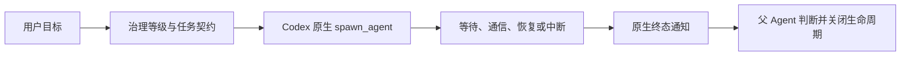

# Subagent Governance

[English](README.en.md) | 简体中文

面向 Codex 原生子 Agent 的生命周期治理插件，让派发、等待、恢复、终态通知和关闭从口头约定变成可说明、可追踪、可恢复的协作流程。

本项目坚持 **Codex-first**：保留 `spawn_agent`、`send_message`、`followup_task`、`wait_agent` 和 `interrupt_agent`，不引入第二套编排平台，也不替代 Codex 沙箱、批准机制或父 Agent 的业务判断。

## 核心能力

| 能力 | 说明 |
| --- | --- |
| 分级治理 | 使用 `light`、`standard`、`strict` 或 `auto` 匹配任务风险。 |
| 统一任务契约 | 强制显式声明目标、范围、禁止事项、完成条件、任务特征、模型、强度和上下文策略。 |
| 可验证上下文 | 使用 `context_manifest` 明确无依赖或验证工作区/Git 基线中的必需路径，并在实际调用前复核变化。 |
| 确定性派发 | PreparedContract 和 task ref 在发送前约束 governed spawn。 |
| 有序等待与有限恢复 | 区分正常长耗时、平台错误、未知调用和真实终态，限制重试。 |
| 显式通信与中断 | 区分普通消息、平台恢复、业务继续和主动中断。 |
| 终态通知观察 | 记录精确 sender、task、attempt 和 terminal status，不保存通知正文。 |
| 生命周期关闭 | 父 Agent 直接判断业务结果，插件只执行 `close_task`。 |
| 三平面状态 | 每个 execution 只维护 dispatch、observation 和 closure。 |
| 只读诊断与轻量 Group | 展示生命周期事实并聚合 required 成员，不建立组级调度器。 |



插件不规定结构化业务结果格式，不创建独立结果文件，不维护 acceptance、SHA 或结果补交流程。父 Agent 直接阅读子 Agent 的原生最终回复，插件只保证通知关联和状态维护正确。

任务契约不会扫描或评分自然语言。模型必须逐项提供契约字段；可以用 `[]` 或 `null` 明确表示无内容。必需文件不使用自然语言猜测，而由 `context_manifest` 声明为 `none` 或 `declared`。declared 模式只读取明确列出的路径，并机械验证工作区、Git commit、文件类型和内容摘要；`working_tree` 只接受逐文件声明，目录依赖使用 `git_commit` tree object ID。

对于不经过原生 `spawn_agent` 的独立任务交接，可以在派发前将 manifest 通过标准输入交给 `python3 scripts/subagent_governance.py --verify-context-manifest`。该命令只返回验证事实，不创建治理状态，也不能硬拦截 `create_thread`。

StateStore 只接受严格的 `state_format_version=6` 与 `state-v6` 命名空间。根记录、task、execution、pending、health、tombstone、agent 和 group 都使用关闭字段集合；缺少版本、版本不匹配、`managed=false` 或任何未知持久化字段都会直接拒绝，且不读取、迁移、删除旧 `state-v1`。

如果 initial PreparedContract 已缺失且超过5分钟，同时 canonical state 仍精确证明派发从未被 claim、没有 target、没有平台观察或终态，SessionStart/SessionEnd 会把这条未启动工作项自动关闭并保留7天 tombstone。它不会伪造 completed 或终态通知；claimed、unknown、并发变化和任何可能已创建 Agent 的状态都会保留给 reconcile。

## 适用范围

- Codex CLI 或 ChatGPT 桌面版中的 Codex
- macOS、Linux 和 Windows
- Python 3.11 或 3.12

## 快速安装

从公开 Git-backed Marketplace 安装：

```bash
codex plugin marketplace add uigdwunm/subagent-governance --ref main
codex plugin add subagent-governance@subagent-governance
```

安装后：

1. 结束当前任务并新建一个 Codex 任务。
2. 在 Codex CLI 中运行 `/hooks`，审查并信任插件 Hook。
3. 新建任务，显式使用 `$subagent-governance` 派发只读子 Agent，验证派发、等待和终态闭环。

未经用户 review/trust 的非 managed 生命周期 Hook 会被 Codex 跳过。

## 最小示例

```text
使用 $subagent-governance，以 light 模式派发一个只读 Agent，
检查 README 的安装步骤是否完整，并返回可核对的结论。
```

治理等级：

- `light`：边界清楚、只读、短时、低风险。
- `standard`：普通编码、诊断、研究和 Review。
- `strict`：安全、生产、破坏性、并发写入或复杂协作任务。
- `auto`：按结构化任务特征机械选择。

## 终态通知

子 Agent 通过原生最终回复报告实际结果、验证证据和剩余事项。父 Agent 收到当前原生通知后，可记录最小生命周期观察：

```bash
python3 scripts/subagent_governance.py --record-terminal-notification --session <session_id>
```

```json
{
  "sender_target": "/root/<exact-native-agent-target>",
  "task_id": "<task_id>",
  "attempt": 1,
  "terminal_status": "completed"
}
```

插件核对 `sender_target == dispatch_record.dispatch_target` 和精确 `task_id + attempt`。相同通知重放幂等，冲突 terminal status 保留首个事实并进入 reconcile。通知正文不会被扫描或持久化。

父 Agent 完成业务判断后，通过 `--parent-disposition` 选择：

- `close_task`：关闭 work item；明确仍运行的 attempts 返回 interrupt targets。

## 数据、网络与隐私

- 核心运行时不主动联网，也不包含遥测或远程控制面。
- Marketplace 安装和升级由 Codex 完成，可能访问插件 Git 仓库。
- 本地状态只保存任务标识、Agent 映射、有限契约摘要、生命周期、通知观察和 tombstone。
- 本地只保存当前格式的治理状态；非当前格式不会被读取、转换或写回。
- 卸载不会自动删除当前插件数据。

## 重要边界

- 插件是协作治理层，不是安全沙箱，不授予额外文件、网络或外部系统权限。
- Hook trust、事件投递、原生身份和工具响应属于 Codex 平台边界。
- 无 `sg_` 前缀的原生 spawn 按 unmanaged 放行且不创建治理状态。
- 插件不注册 `SubagentStart`、`SubagentStop`；这两个原生事件不参与状态维护或通知处理。
- `list_agents` 只读取顶层 `agents` 并要求 exact canonical target。平台 terminal 只进入 `await_notification`，不替代原生通知。
- Stop 只显示 advisory 并固定 fail-open，不替父 Agent 判断业务结果。
- 升级前结束当前任务；安装成功后只保留目标版本缓存，并在新任务中验证。

完整安全边界见 [SECURITY.md](SECURITY.md)。

## 可选全局入口

显式 `$subagent-governance` 无需全局配置。如果希望 Codex 在准备调用原生子 Agent 工具时按需加载 Skill，可安装受管理的 `AGENTS.md` 区间。

macOS/Linux：

```bash
python3 <installed-plugin-root>/scripts/apply_agents_block.py --execute
```

Windows PowerShell：

```powershell
py -3 <installed-plugin-root>\scripts\apply_agents_block.py --execute
```

## 升级与卸载

```bash
codex plugin marketplace upgrade subagent-governance
python3 <installed-plugin-root>/scripts/reinstall_plugin.py \
  --target-version <full-manifest-version>
```

升级后重新检查 `/hooks` 并新建任务。卸载前如安装过全局入口：

```bash
python3 <installed-plugin-root>/scripts/apply_agents_block.py --remove
codex plugin remove subagent-governance@subagent-governance
codex plugin marketplace remove subagent-governance
```

## 诊断与 Group

诊断纯只读，不创建或修复治理数据：

```bash
python3 scripts/subagent_governance.py --diagnose --data-root /path/to/governance-data
python3 scripts/subagent_governance.py --diagnose --data-root /path/to/governance-data --session <session_id>
```

轻量 Group：

```bash
python3 scripts/subagent_governance.py --upsert-group --session <session_id> --data-root /path/to/governance-data < group.json
python3 scripts/subagent_governance.py --read-group --session <session_id> --group-id <group_id> --data-root /path/to/governance-data
```

`summary_ready` 表示 required 成员已收到终态通知或已关闭；`group_action_required` 表示 required 成员仍有待处理生命周期动作。

## 开发验证

```bash
python3 -m pip install -r requirements-dev.txt
python3 -m unittest discover -s tests -v
python3 -m compileall -q scripts
ruff check scripts tests
coverage run -m unittest discover -s tests -v
coverage report
python3 scripts/release_preflight.py --mode development
python3 ~/.codex/skills/.system/plugin-creator/scripts/validate_plugin.py .
python3 ~/.codex/skills/.system/skill-creator/scripts/quick_validate.py skills/subagent-governance
```

- [贡献说明](CONTRIBUTING.md)
- [当前架构](docs/architecture.md)
- [中断对账](docs/interruption-reconciliation.md)
- [平台验收摘要](docs/platform-validation.md)
- [发布流程](docs/release-process.md)

## 许可证

MIT，详见 [LICENSE](LICENSE)。
